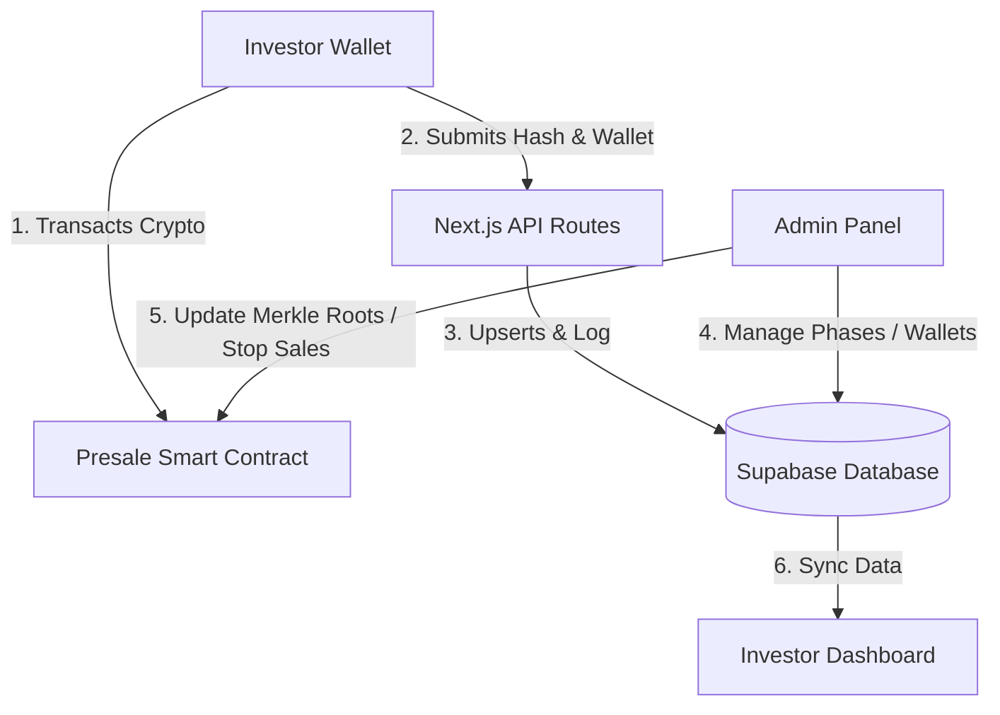
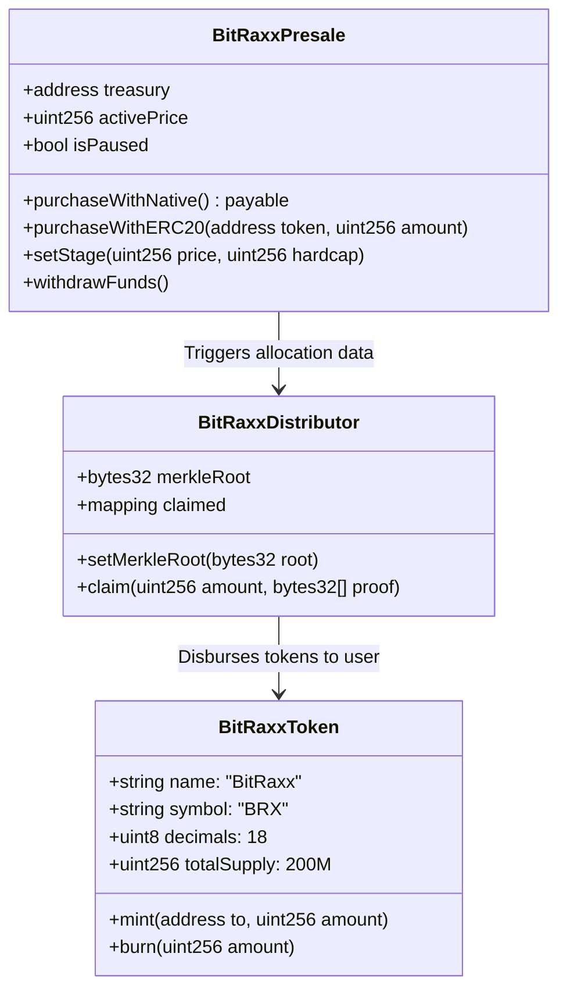

# BitRaxx Presale Ecosystem: Backend & Web3 Technical Specification

This document provides a comprehensive, production-ready system architecture blueprint for upgrading the **BitRaxx ($BRX)** web application from a static frontend mockup to a fully dynamic, enterprise-grade Web3 platform.

It outlines the complete **Database Schema (Supabase/PostgreSQL)**, **Next.js Serverless APIs**, **EVM Smart Contracts**, and a **Page-by-Page Integration Map** detailing how the frontend pages connect to the backend and blockchain systems.

---

## 1. System Overview Architecture

The BitRaxx ecosystem is split into three main tiers that work in concert:
1. **Frontend (Next.js & Web3 Connectors)**: Renders the premium UI, manages user wallet states using RainbowKit + Wagmi + Viem, and interacts directly with EVM smart contracts.
2. **Backend (Serverless APIs & Supabase DB)**: Captures transaction hashes, monitors user preferences, provides real-time statistics, delivers admin management panels, and logs off-chain data (e.g., KYC states, referral mappings, and announcements).
3. **Smart Contracts (EVM - Ethereum & BSC)**: Governs the actual receipt of crypto funds, manages on-chain token rates, holds the total token supply ($BRX), and manages secure, verified claim and allocation disbursements.



---

## 2. Database Schema Specification (Supabase / PostgreSQL)

This schema covers all off-chain storage requirements. It is designed for standard Postgres with full support for Supabase real-time subscriptions, foreign keys, and performant indexes.

### Complete SQL Schema DDL

Run this script in your Supabase SQL Editor to initialize all tables, types, foreign keys, and indexes:

```sql
-- Enable necessary extensions
CREATE EXTENSION IF NOT EXISTS "uuid-ossp";

-- Define Enums
CREATE TYPE verification_status_type AS ENUM ('Verified', 'Pending', 'Flagged');
CREATE TYPE transaction_status_type AS ENUM ('Success', 'Pending', 'Failed');
CREATE TYPE phase_status_type AS ENUM ('Upcoming', 'Active', 'Completed', 'Paused');
CREATE TYPE payout_status_type AS ENUM ('Pending', 'Distributed');
CREATE TYPE token_type AS ENUM ('Stablecoin', 'Native');

-- 1. Investors Table
CREATE TABLE public.investors (
    wallet_address VARCHAR(42) PRIMARY KEY, -- Normalised to lowercase hex
    verification_status verification_status_type DEFAULT 'Pending'::verification_status_type,
    total_invested_usd NUMERIC(16, 4) DEFAULT 0.0000,
    brx_allocation NUMERIC(24, 6) DEFAULT 0.000000,
    latest_network VARCHAR(50),
    created_at TIMESTAMP WITH TIME ZONE DEFAULT timezone('utc'::text, now()) NOT NULL,
    last_seen_at TIMESTAMP WITH TIME ZONE DEFAULT timezone('utc'::text, now()) NOT NULL
);

-- Index for searching and analytics
CREATE INDEX idx_investors_status ON public.investors(verification_status);

-- 2. Presale Stages Table
CREATE TABLE public.presale_stages (
    id SERIAL PRIMARY KEY,
    name VARCHAR(100) NOT NULL,
    price_usd NUMERIC(12, 6) NOT NULL, -- e.g., 0.005000
    hard_cap_usd NUMERIC(16, 2) NOT NULL, -- e.g., 1000000.00
    raised_usd NUMERIC(16, 2) DEFAULT 0.00,
    status phase_status_type DEFAULT 'Upcoming'::phase_status_type,
    start_date TIMESTAMP WITH TIME ZONE,
    end_date TIMESTAMP WITH TIME ZONE,
    created_at TIMESTAMP WITH TIME ZONE DEFAULT timezone('utc'::text, now()) NOT NULL,
    updated_at TIMESTAMP WITH TIME ZONE DEFAULT timezone('utc'::text, now()) NOT NULL
);

-- Index for checking active stages quickly
CREATE INDEX idx_stages_status ON public.presale_stages(status);

-- 3. Transactions Table
CREATE TABLE public.transactions (
    tx_hash VARCHAR(66) PRIMARY KEY, -- Normalised to lowercase hex
    wallet_address VARCHAR(42) REFERENCES public.investors(wallet_address) ON DELETE CASCADE NOT NULL,
    payment_token VARCHAR(10) NOT NULL, -- e.g., USDT, ETH, BNB
    amount_paid NUMERIC(28, 18) NOT NULL, -- On-chain raw amount decimal
    amount_paid_usd NUMERIC(16, 4) DEFAULT 0.0000, -- Converted fiat valuation
    brx_quantity NUMERIC(24, 6) NOT NULL, -- Quantity of BRX allocated
    network VARCHAR(50) NOT NULL, -- e.g., ETH, BSC
    status transaction_status_type DEFAULT 'Pending'::transaction_status_type,
    stage_id INT REFERENCES public.presale_stages(id),
    captured_at TIMESTAMP WITH TIME ZONE DEFAULT timezone('utc'::text, now()) NOT NULL,
    confirmed_at TIMESTAMP WITH TIME ZONE
);

CREATE INDEX idx_transactions_wallet ON public.transactions(wallet_address);
CREATE INDEX idx_transactions_status ON public.transactions(status);

-- 4. Referrals Table
CREATE TABLE public.referrals (
    id UUID PRIMARY KEY DEFAULT uuid_generate_v4(),
    referrer_address VARCHAR(42) REFERENCES public.investors(wallet_address) ON DELETE RESTRICT NOT NULL,
    referred_address VARCHAR(42) REFERENCES public.investors(wallet_address) ON DELETE RESTRICT UNIQUE NOT NULL,
    referred_volume_usd NUMERIC(16, 4) DEFAULT 0.0000,
    reward_brx NUMERIC(24, 6) DEFAULT 0.000000,
    payout_status payout_status_type DEFAULT 'Pending'::payout_status_type,
    created_at TIMESTAMP WITH TIME ZONE DEFAULT timezone('utc'::text, now()) NOT NULL
);

CREATE INDEX idx_referrals_referrer ON public.referrals(referrer_address);

-- 5. Announcements Table
CREATE TABLE public.announcements (
    id SERIAL PRIMARY KEY,
    title VARCHAR(255) NOT NULL,
    tag VARCHAR(50) NOT NULL, -- e.g., 'Important', 'Feature', 'Ecosystem'
    description TEXT NOT NULL,
    color VARCHAR(50) DEFAULT 'text-acid-lime',
    is_visible BOOLEAN DEFAULT TRUE,
    published_at TIMESTAMP WITH TIME ZONE DEFAULT timezone('utc'::text, now()) NOT NULL
);

-- 6. Company Wallets Table
CREATE TABLE public.company_wallets (
    id VARCHAR(50) PRIMARY KEY, -- e.g., 'treasury', 'marketing'
    label VARCHAR(100) NOT NULL,
    address VARCHAR(42) NOT NULL,
    description TEXT,
    updated_at TIMESTAMP WITH TIME ZONE DEFAULT timezone('utc'::text, now()) NOT NULL
);

-- 7. Accepted Tokens Table
CREATE TABLE public.accepted_tokens (
    id SERIAL PRIMARY KEY,
    name VARCHAR(10) NOT NULL, -- e.g., USDT, ETH, BNB
    token_type token_type NOT NULL,
    status VARCHAR(20) DEFAULT 'Enabled', -- e.g., Enabled, Disabled
    network VARCHAR(50) NOT NULL -- e.g., BSC, ETH
);

-- 8. User Notification Preferences Table
CREATE TABLE public.user_preferences (
    wallet_address VARCHAR(42) PRIMARY KEY REFERENCES public.investors(wallet_address) ON DELETE CASCADE,
    purchase_confirmations BOOLEAN DEFAULT TRUE,
    phase_adjustments BOOLEAN DEFAULT TRUE,
    referral_rewards BOOLEAN DEFAULT TRUE,
    updated_at TIMESTAMP WITH TIME ZONE DEFAULT timezone('utc'::text, now()) NOT NULL
);

-- Insert Initial Company Wallets Mocking
INSERT INTO public.company_wallets (id, label, address, description) VALUES
('treasury', 'Treasury Wallet', '0x71C7656EC7ab88b098defB751B7401B5f6d8976F', 'Main secure storage for USD/ETH/BNB incoming funds.'),
('marketing', 'Marketing Fund', '0x250F29d8EC2ab88b098defB751B7401B5f6d8976F', 'Dedicated treasury to disburse referral incentives.');

-- Insert Default Accepted Tokens Mocking
INSERT INTO public.accepted_tokens (name, token_type, status, network) VALUES
('USDT', 'Stablecoin', 'Enabled', 'BSC'),
('ETH', 'Native', 'Enabled', 'ETH'),
('BNB', 'Native', 'Enabled', 'BSC'),
('USDT', 'Stablecoin', 'Enabled', 'ETH');

-- Insert Initial Mock Presale Stages
INSERT INTO public.presale_stages (name, price_usd, hard_cap_usd, raised_usd, status) VALUES
('Private Sale', 0.002000, 1000000.00, 1000000.00, 'Completed'),
('ICO Phase 1', 0.005000, 6000000.00, 4285910.00, 'Active'),
('ICO Phase 2', 0.008000, 10000000.00, 0.00, 'Upcoming');
```

### Automation Triggers & Functions (Triggers on Transaction Success)

To ensure backend totals and investor statistics remain perfectly accurate without manual calculations, the database uses PostgreSQL triggers:

```sql
-- Function to automatically update investor sums on transaction state change
CREATE OR REPLACE FUNCTION public.handle_successful_transaction()
RETURNS TRIGGER AS $$
BEGIN
    IF NEW.status = 'Success'::transaction_status_type AND (OLD IS NULL OR OLD.status <> 'Success'::transaction_status_type) THEN
        -- 1. Update Investor Aggregations
        UPDATE public.investors
        SET 
            total_invested_usd = total_invested_usd + COALESCE(NEW.amount_paid_usd, 0.0000),
            brx_allocation = brx_allocation + COALESCE(NEW.brx_quantity, 0.000000),
            last_seen_at = timezone('utc'::text, now())
        WHERE wallet_address = NEW.wallet_address;

        -- 2. Update Stage Raised Totals
        IF NEW.stage_id IS NOT NULL THEN
            UPDATE public.presale_stages
            SET raised_usd = raised_usd + COALESCE(NEW.amount_paid_usd, 0.00)
            WHERE id = NEW.stage_id;
        END IF;

        -- 3. Calculate Referral Incentives (if referred exists)
        PERFORM public.process_referral_reward(NEW.wallet_address, NEW.amount_paid_usd, NEW.brx_quantity);

    END IF;
    RETURN NEW;
END;
$$ LANGUAGE plpgsql SECURITY DEFINER;

-- Trigger attachment
CREATE TRIGGER trg_on_transaction_success
    AFTER INSERT OR UPDATE ON public.transactions
    FOR EACH ROW
    EXECUTE FUNCTION public.handle_successful_transaction();

-- Helper function to process referrals automatically
CREATE OR REPLACE FUNCTION public.process_referral_reward(
    p_referred VARCHAR(42),
    p_volume_usd NUMERIC(16, 4),
    p_quantity_brx NUMERIC(24, 6)
)
RETURNS VOID AS $$
DECLARE
    v_referrer VARCHAR(42);
    v_reward_brx NUMERIC(24, 6);
BEGIN
    -- Check if this user was referred by someone
    SELECT referrer_address INTO v_referrer 
    FROM public.referrals 
    WHERE referred_address = p_referred LIMIT 1;

    IF v_referrer IS NOT NULL THEN
        -- Calculate 5% referral reward in BRX
        v_reward_brx := p_quantity_brx * 0.05;

        UPDATE public.referrals
        SET 
            referred_volume_usd = referred_volume_usd + p_volume_usd,
            reward_brx = reward_brx + v_reward_brx
        WHERE referred_address = p_referred;
    END IF;
END;
$$ LANGUAGE plpgsql SECURITY DEFINER;
```

---

## 3. Serverless API Specification (Next.js)

Instead of a standalone Express server, Next.js App Router API Route Handlers (`src/app/api/.../route.js`) connect to Supabase. This keeps hosting simple and integrates cleanly with Next.js middleware and SSR.

### A. Investor API Enclaves

#### 1. Submit Transaction Hash
* **Route**: `/api/transactions`
* **Method**: `POST`
* **Purpose**: Saves a transaction hash to the database the moment an investor initiates on-chain payment.
* **Payload**:
```json
{
  "transactionHash": "0x7a2bf56b71c7656ec7ab88b098defb751b7401b5f6d8976fdfb751b7401b5f6d",
  "walletAddress": "0x71c7656ec7ab88b098defb751b7401b5f6d8976f",
  "paymentToken": "USDT",
  "amountPaid": "100.00",
  "amountPaidUsd": 100.00,
  "brxQuantity": 20000,
  "network": "BSC",
  "stageId": 2
}
```
* **Response (Success - 200 OK)**:
```json
{
  "ok": true,
  "status": "Pending",
  "message": "Transaction captured successfully. Awaiting on-chain verification."
}
```

#### 2. Get Investor Portfolio Stats
* **Route**: `/api/dashboard/stats?wallet=<address>`
* **Method**: `GET`
* **Purpose**: Retrieves all portfolio aggregate values to populate the Stats Cards on the dashboard.
* **Response (Success - 200 OK)**:
```json
{
  "ok": true,
  "stats": {
    "totalInvestedUsd": 5250.00,
    "brxAllocation": 1050000.00,
    "referralRewardsBrx": 15000.00,
    "verificationStatus": "Verified",
    "activeStage": {
      "name": "ICO Phase 1",
      "priceUsd": 0.005,
      "raisedUsd": 4285910.00,
      "hardCapUsd": 6000000.00,
      "percentComplete": 71.43
    }
  }
}
```

#### 3. Fetch User Referral Data
* **Route**: `/api/dashboard/referrals?wallet=<address>`
* **Method**: `GET`
* **Purpose**: Fetches the unique referral link, overview metrics, and referred user details.
* **Response (Success - 200 OK)**:
```json
{
  "ok": true,
  "referralLink": "https://brx.io/ref/BRX9281",
  "metrics": {
    "totalReferrals": 12,
    "referredVolumeUsd": 4500.00,
    "rewardBrx": 15000.00
  },
  "referredInvestors": [
    { "wallet": "0x123...456", "amountPaidUsd": 1200.00, "rewardBrx": 6000.00, "date": "2026-05-20" },
    { "wallet": "0x789...abc", "amountPaidUsd": 500.00, "rewardBrx": 2500.00, "date": "2026-05-18" }
  ]
}
```

---

### B. Admin API Enclaves (Protected via Admin Key Header)

All Admin routes must include the header: `X-Admin-Key: <ADMIN_SECRET_KEY>`.

#### 1. Add or Edit Sale Phase
* **Route**: `/api/admin/stages`
* **Method**: `POST`
* **Purpose**: Modifies or appends stages in `presale_stages`.
* **Payload**:
```json
{
  "stageId": 2,
  "name": "ICO Phase 1",
  "priceUsd": 0.005,
  "hardCapUsd": 6000000.00,
  "status": "Active"
}
```
* **Response (Success - 200 OK)**:
```json
{ "ok": true, "message": "Sale phase updated successfully." }
```

#### 2. Terminate or Stop Sale
* **Route**: `/api/admin/stages/pause`
* **Method**: `POST`
* **Purpose**: Pauses all active smart contract operations and changes the active phase status in the database to `Paused`.
* **Payload**:
```json
{ "stageId": 2, "pauseReason": "Volatile market conditions" }
```
* **Response (Success - 200 OK)**:
```json
{ "ok": true, "message": "Global presale has been set to PAUSED status." }
```

#### 3. Trigger Bulk Token Distributions
* **Route**: `/api/admin/allocations/distribute`
* **Method**: `POST`
* **Purpose**: Generates final allocations, calculates a secure **Merkle Tree Root**, writes the root to the smart contract, and updates all pending statuses in database to `Distributed`.
* **Payload**:
```json
{ "stageId": 2 }
```
* **Response (Success - 200 OK)**:
```json
{
  "ok": true,
  "merkleRoot": "0x53965d14dfb751b7401b5f6d8976f7a2bf56b71c7656ec7ab88b098defb751b7",
  "totalDistributedBrx": 124700000.00
}
```

---

## 4. Web3 & Smart Contract Architecture

The core of the decentralised platform is implemented using three main smart contracts in Solidity (compiled with `0.8.20` or higher).



### A. Contract Spec 1: `BitRaxxToken.sol` (EVM Standard)
A standard ERC-20 token contract built using OpenZeppelin standards. It supports burning, supply ceilings, and safe administrative freezing.
* **Standards Used**: `ERC20`, `ERC20Burnable`, `Ownable2Step`, `Pausable`.
* **Key Parameters**:
  * Total Supply Cap: `200,000,000 * 10^18` (200 Million tokens).

### B. Contract Spec 2: `BitRaxxPresale.sol` (Fund Accumulator)
This contract is deployed on both **Ethereum Mainnet** and **BNB Smart Chain (BSC)**. It receives native tokens (ETH/BNB) or stablecoins (USDT/USDC) from investors and routes them directly to secure treasury wallets.
* **Core Functions**:
  * `purchaseWithNative()`: Allows direct purchases using ETH or BNB. It calculates token amounts dynamically using a Chainlink Price Feed oracle (`ETH/USD` or `BNB/USD`).
  * `purchaseWithERC20(address token, uint256 amount)`: Accepts predefined stablecoins (e.g. BEP-20 USDT, ERC-20 USDT). Fails if the token address is not whitelisted by the admin.
  * `setStage(uint256 price, uint256 hardcap)`: Allows admin to alter prices or caps on-chain.
  * `pauseSale() / resumeSale()`: Pauses purchases globally in case of emergency.
* **Security Constraints**:
  * **Auto-Forwarding**: Incoming funds must never remain stored in the presale contract itself. The contract automatically forwards native or stablecoin balances to the designated `treasuryWallet` upon every successful transaction. This prevents hacks from draining the contract.
  * **Reentrancy Guard**: Every entry function uses OpenZeppelin's `nonReentrant` modifier.

### C. Contract Spec 3: `BitRaxxDistributor.sol` (Vesting & Claims)
To save enormous gas fees for the project owner, we avoid writing thousands of on-chain allocations to state. Instead, we use a **Merkle Tree Claims Distributor**.
1. **How it works**:
   - The backend aggregates all successful transactions from `transactions` table.
   - It constructs a Merkle Tree where each leaf node consists of: `keccak256(abi.encodePacked(walletAddress, brxAllocation))`.
   - The admin publishes the resulting **Merkle Root** to this contract using `setMerkleRoot(bytes32 root)`.
   - When the user visits the dashboard to claim their tokens, the Next.js API generates their custom **Merkle Proof**.
   - The investor calls `claim(uint256 amount, bytes32[] proof)` on the contract. The contract verifies the proof against the root. If valid, it transfers the precise `$BRX` quantity from its balance to the investor.
* **Core Functions**:
  * `claim(uint256 amount, bytes32[] proof)`: Secure, gas-efficient on-chain claiming.
  * `setMerkleRoot(bytes32 root)`: Allows updates at the end of each presale phase.

---

## 5. Page-by-Page Integration Specification

This section maps the current frontend pages directly to their corresponding Backend DB tables, Next.js Serverless API endpoints, and Smart Contract events.

| Page / Component | UI Visual Element | Backend DB Table | Next.js API Endpoint | Web3 / Smart Contract Method |
| :--- | :--- | :--- | :--- | :--- |
| **Home Page** (`page.js`) | Hero Section: "Phase 1 Active" status | `presale_stages` | `GET /api/announcements` | *None (Reads SSR from DB)* |
| **Home Page** (`page.js`) | Calculator Widget: Network, pay amount, tokens received | `accepted_tokens` | `GET /api/dashboard/stats` | Chainlink Price Feed: `latestAnswer()` (Native pricing) |
| **Home Page** (`page.js`) | Roadmap milestones and timelines | `presale_stages` | *Static (Optional: DB sync)* | *None* |
| **Dashboard** (`dashboard/page.js`) | Portfolio Stats: Total Invested, Allocation, Rewards | `investors`, `referrals` | `GET /api/dashboard/stats?wallet=<addr>` | *None (Reads calculated DB values)* |
| **Dashboard** (`dashboard/page.js`) | Presale Progress: Raised, Remaining, Time Left | `presale_stages` | `GET /api/dashboard/stats` | `BitRaxxPresale.isPaused()`, total raised limits |
| **Dashboard** (`dashboard/page.js`) | Recent Activity: List of transactions with status | `transactions` | `GET /api/dashboard/transactions` | *None (Cached in DB for fast queries)* |
| **Referrals** (`dashboard/referrals/page.js`)| Metrics and Referred Investors table | `referrals`, `investors` | `GET /api/dashboard/referrals` | *None* |
| **Referrals** (`dashboard/referrals/page.js`)| Copy Referral Link | `referrals` | `GET /api/dashboard/referrals` | Generates `/ref/<referral_id>` |
| **Settings** (`dashboard/settings/page.js`) | Active Connected Address and Disconnect | `investors` | `POST /api/capture-wallet` | Wagmi: `useAccount()`, `useDisconnect()` |
| **Settings** (`dashboard/settings/page.js`) | Notification Preference Toggles | `user_preferences`| `POST /api/dashboard/preferences`| *None* |
| **Announcements** (`dashboard/announcements/page.js`)| Published news articles and tags | `announcements` | `GET /api/announcements` | *None* |
| **Admin Panel** (`admin/page.js`) | Dashboard Tab: Global platform analytics | All tables | `GET /api/admin/stats` | *Reads contract balances* |
| **Admin Panel** (`admin/page.js`) | Investors Tab: Verified / Flagged table | `investors` | `GET /api/admin/investors` | *None* |
| **Admin Panel** (`admin/page.js`) | Transactions Tab: Search by hash, edit state | `transactions` | `GET /api/admin/transactions` | *None* |
| **Admin Panel** (`admin/page.js`) | Stages Tab: Create stages, Edit pricing | `presale_stages` | `POST /api/admin/stages` | `BitRaxxPresale.setStage()` |
| **Admin Panel** (`admin/page.js`) | Allocations Tab: Bulk Distribute / Merkle Root | `transactions` | `POST /api/admin/allocations/distribute`| `BitRaxxDistributor.setMerkleRoot()` |
| **Admin Panel** (`admin/page.js`) | Settings Tab: Manage Company Wallets & Tokens | `company_wallets`, `accepted_tokens` | `POST /api/admin/wallets` | `BitRaxxPresale.updateTreasury()` |

---

## 6. Recommended Next Steps for Implementation

To implement this specification in stages:
1. **Deploy the Smart Contracts**: Write and test the three Solidity contracts (`BitRaxxToken`, `BitRaxxPresale`, and `BitRaxxDistributor`) using Hardhat or Foundry. Deploy to Ethereum Sepolia and BSC Testnet first.
2. **Setup Supabase Schema**: Execute the SQL DDL script in your Supabase DB dashboard. Enable PostgreSQL Row-Level Security (RLS) policies for secure investor queries.
3. **Build API Route Handlers**: Replace the mock data arrays in your Next.js frontend with dynamic server-side fetches calling `/api/dashboard/stats`, `/api/dashboard/referrals`, and `/api/announcements`.
4. **Link Frontend to Contracts**: Bind Wagmi hooks (like `useWriteContract` and `useWatchContractEvents`) to the purchase button inside the presale calculator widget to invoke actual on-chain transaction hashes, and POST them to `/api/transactions`.
5. **Set up Webhook/Indexer**: Build a simple background worker or use a web3 listener (like QuickNode Webhooks or Gelato) to listen for transfer events on-chain and automatically toggle transaction status to `Success` in the Supabase database.
